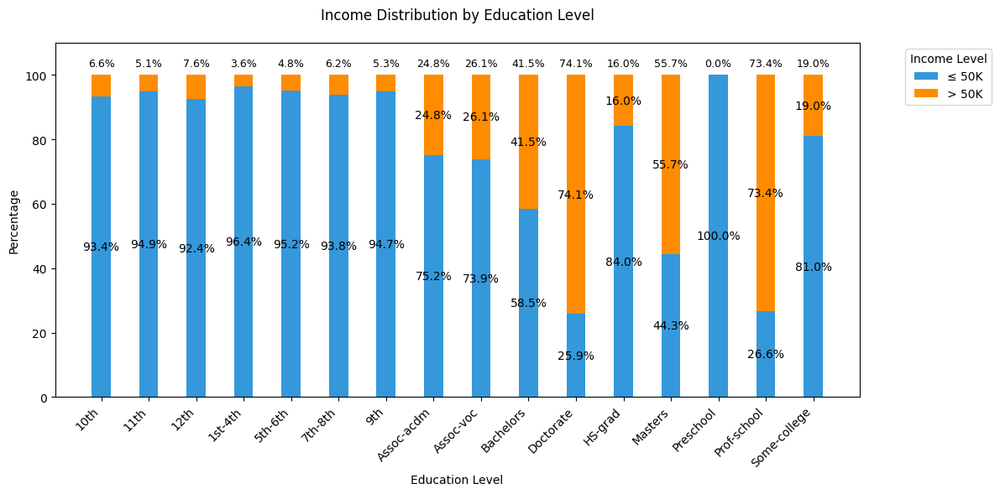
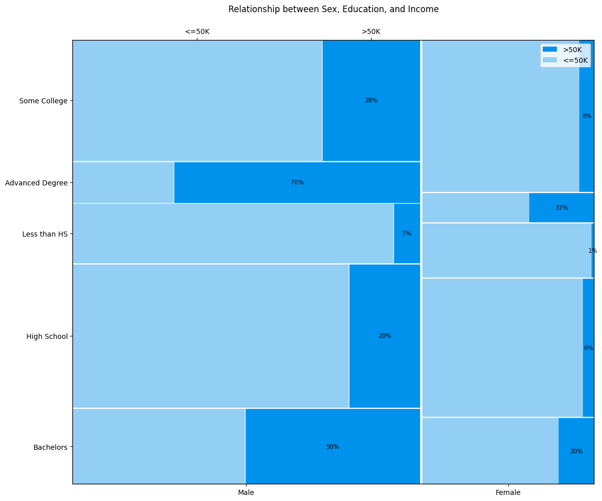

# Demographic Income Insights

[](https://www.python.org/)  
[](https://jupyter.org/)  
[](LICENSE)


## 📜 Project Description

Creating a collection of visualizations to analyze data from the United States Census Bureau. The goal is to uncover demographic patterns that predict whether an individual earns above or below \$50,000 annually. These insights can support university marketing teams in crafting targeted outreach strategies.

**Note:** This project is inspired by a data visualization course (CSE 578) with Arizona State University.


## 📋 Table of Contents

1. [Demo & Screenshots](#-demo--screenshots)  
2. [Project Structure](#-project-structure)  
3. [Getting Started](#-getting-started)  
4. [Data & Cleaning](#-data--cleaning)  
5. [Notebooks & Usage](#-notebooks--usage)  
6. [Next Steps](#-next-steps)  
7. [License](#-license)  
8. [Contact](#-contact)


## 🎬 Demo & Screenshots

**Sample Viz #1:** stacked bar chart displaying individuals' income distribution based on their education level.



**Sample Viz #2:** mosaic plot describing the income distribution of groups based on sex and education together.




## 🗂 Project Structure

```text
demographic-income-insights/
├── data/
│   └── adult.data                # Raw Census dataset
│
├── notebooks/
│   ├── 01_age_income.ipynb                 # Age vs. Income analysis
│   ├── 02_education_income.ipynb           # Education vs. Income analysis
│   ├── 03_multivariate_trends.ipynb        # Parallel coordinates plot
│   ├── 04_race_workclass_heatmap.ipynb     # Race × Workclass heatmap
│   └── 05_sex_education_mosaic.ipynb       # Sex × Education mosaic plot
│
├── clean_dataset.py              # Script to clean & impute missing values
└── requirements.txt              # Python dependencies
```


## 🚀 Getting Started

These instructions will help you run the analysis locally.

### Prerequisites

- Python 3.8 or higher

### Installation

```bash
# 1. Clone the repo
git clone https://github.com/jawuanlewis/demographic-income-insights.git
cd demographic-income-insights

# 2. Create & activate a venv
python3 -m venv venv
source venv/bin/activate

# 3. Install dependencies
pip install -r requirements.txt
```


## 🗃 Data & Cleaning

1. Raw data lives in `data/adult.data` (contains 32,000+ samples of the U.S. population, and their demographic data).

2. Missing values (?) are replaced with the column mode.

3. To regenerate the cleaned dataset (CSV), run:

```bash
python3 clean_dataset.py
```

This produces `data/cleaned_census_data.csv`, which all notebooks consume.


## 📒 Notebooks & Usage

Each notebook corresponds to a unique user story for universities to leverage when marketing degree programs.

To explore the analyses:

```bash
jupyter lab
```

- Open any notebook in the `notebooks` folder and run cells top-to-bottom.
- Each notebook contains brief story details and a chart (Matplotlib/Seaborn)


## 🔮 Next Steps

- Add geographic or time-series visualizations

- Compare alternative imputation methods

- Build a predictive model (logistic regression, tree-based)

- Package insights in an interactive dashboard (e.g., Streamlit)
